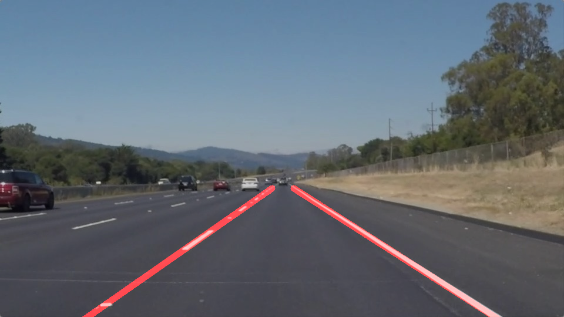
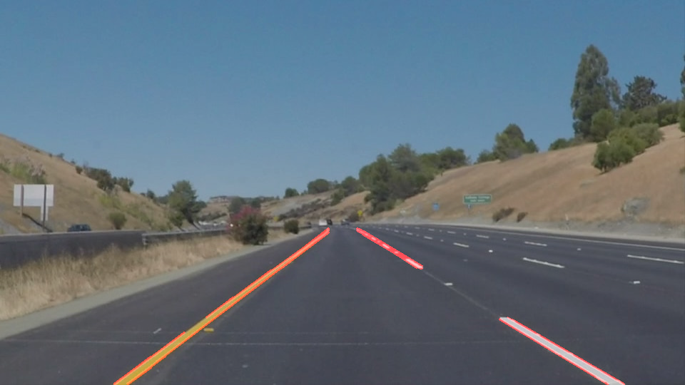
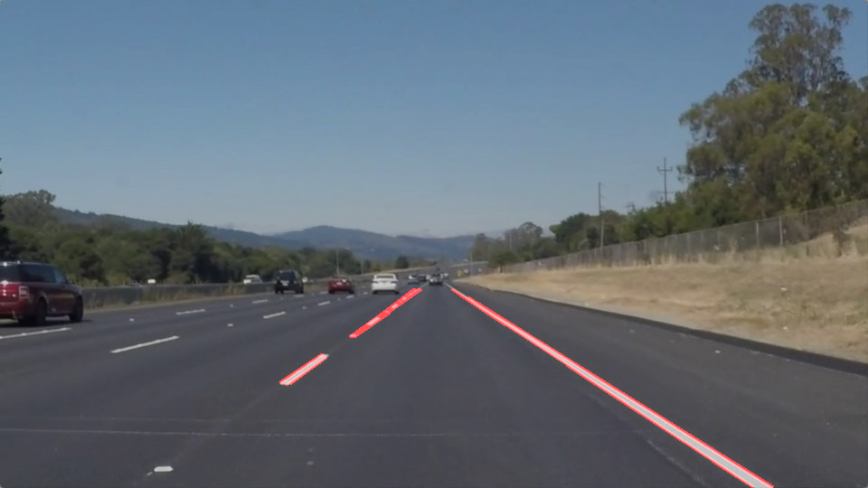
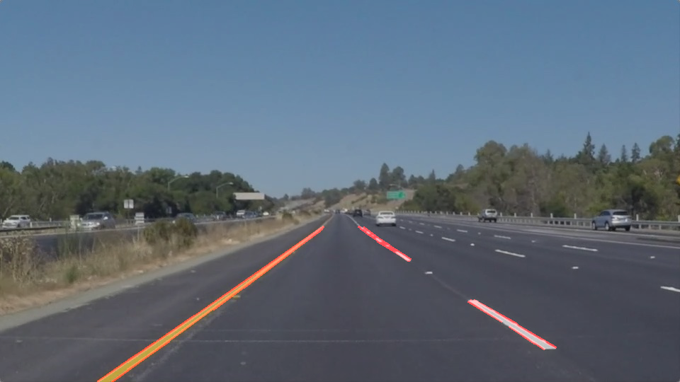
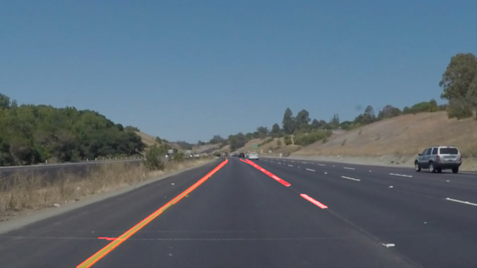
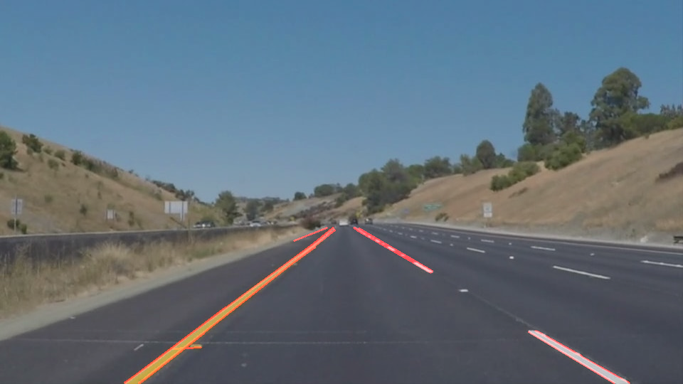

# **Finding Lane Lines on the Road** 

## Writeup Template

### You can use this file as a template for your writeup if you want to submit it as a markdown file. But feel free to use some other method and submit a pdf if you prefer.

---

**Finding Lane Lines on the Road**

The goals / steps of this project are the following:
* Make a pipeline that finds lane lines on the road
* Reflect on your work in a written report

[//]: # (Image References)

[image1]: ./examples/grayscale.jpg "Grayscale"

---

### Reflection

### 1. Describe your pipeline. As part of the description, explain how you modified the draw_lines() function.

My pipeline consisted of 5 steps. First, I converted the images to grayscale,
then I use gaussian blur to remove the extra noise from the image. The third step consists of using canny edge detector filter on the image.
Then I remove the unwanted region from the picture using polygon to separate the area of interest.
In the fifth step, we call hough lines function which transforms point into lines so we can find intersecting lines.
hough lines call draw_lines function to draw a weighted image.

In order to draw a single line on the left and right lanes, I modified the draw_lines() function by first separating lines with positive and negative slope
saving x and y coordinates of negative and positive in separate variables.
Then we will apply polyfit() function separately on positive and negative side coordinates to get the fitting slope and y-intercept of a line.
for every image, we will calculate a running average for y-intercept and slope which we get from polyfit function.
For any image in the video, our function provide slope and intercept not in the x +/- dx range then we will replace those values with the current running average
running averages are added in the memory by using global variables, after this, we draw the line we calculated from line equation Y = MX + C.
these are two single-lines between two points in the image for each side of the lane which will be drawn as a weighted image

Result of few cases from images for testing:

### 2. Identify potential shortcomings with your current pipeline

One potential shortcoming would be what would happen when the road is curved to a point where both the side of the lanes have negative slope or positive slope.
This will lead to change in code to find a way to separate the lines with respect to the position in the image

Another shortcoming could be when the color of the lines is not easily separable by canny edge detector, this will lose the correct path and we have to relay on the running average.

### 3. Suggest possible improvements to your pipeline

A possible improvement would be to separate the lane's points with respect to the position in the image rather than based on the slope of the line.

Another potential improvement could be to use better algorithm to find out lanes and also some other parameters to find the position of the car with respect to the environment (here road)

Sources: 
* comments on udacity https://knowledge.udacity.com/